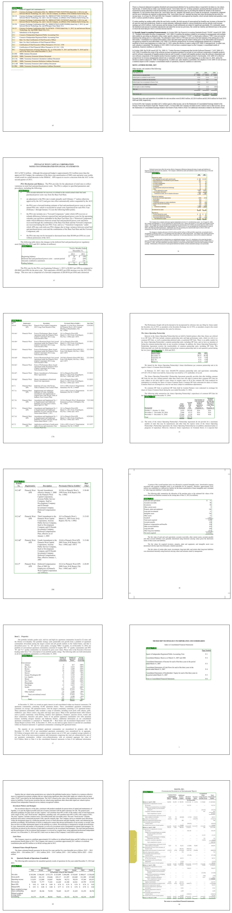

# Table detection via Faster RCNN

This repository contains table detection algorithm based on this [Faster RCNN implementation](https://github.com/tensorpack/tensorpack/tree/master/examples/FasterRCNN).

# Installation

1. Create conda environment `conda env create --file environment.yml`.
2. Activate conda environment `conda activate tabdet`.
3. Download pre-trained backbone from [here](http://models.tensorpack.com/FasterRCNN/ImageNet-R50-AlignPadding.npz).
4. Download and extract [FinTabNet dataset](https://developer.ibm.com/exchanges/data/all/fintabnet/).
5. Run `python convert_pdfs_to_images.py /path/to/fintabnet/pdf /path/to/fintabnet/jpg`.

# Usage

## Training
To train on a single machine (with 1 or more GPUs):
```
./train.py --config \
    BACKBONE.WEIGHTS=/path/to/ImageNet-R50-AlignPadding.npz \
    DATA.BASEDIR=/path/to/fintabnet
    [OTHER-ARCHITECTURE-SETTINGS]
```

All options can be changed by either the command line or the `config.py` file (recommended).
See [config.py](config.py) for details about how to correctly set `BACKBONE.WEIGHTS` and other configs.

## Evaluation

To evaluate the performance of a model on a dataset run
```
./predict.py --evaluate output.json --load /path/to/Trained-Model-Checkpoint \
    --config SAME-AS-TRAINING
```

# Results

All models were trained on fintabnet_train and evaluated on fintabnet_val datasets using
F1 score with IOU thresholds 0.5 and 0.75. All models were fine-tuned from ImageNet pretrained 
R50 models using NVidia GeForce GTX 1080 Ti.

| Model | F1@0.5 | F1@0.75 |
|-------|--------|---------|
| R50-FPN FRCNN* | 0.952 | 0.944 |

\* R50 = ResNet50, FPN = Feature pyramid pooling, FRCNN = Faster RCNN

# Images


